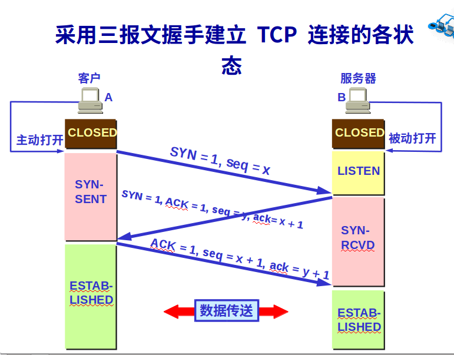
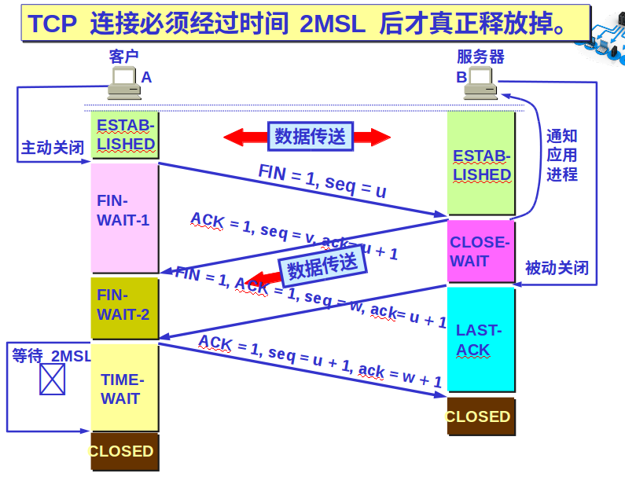
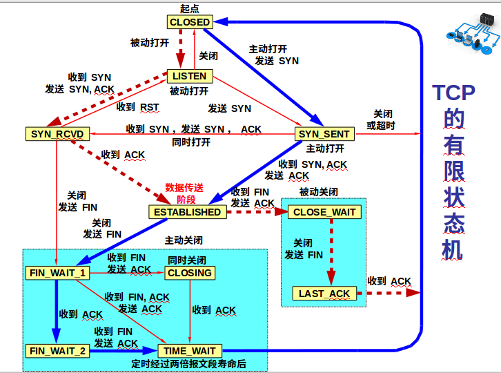

# TCP/IP

+ 复用: 发送方不同的应用进程可以使用同一个运输层协议传送数据

+ 分用: 接收方的运输层在剥去报文的首部后能够把这些数据正确交付目的应用进层

+ 协议端口: 应用层的各种协议进程与运输实体进行层间交互的一种地址. 
TCP/IP的运输层用一个词6位的端口号来标志一个端口.端口号只有本地意义,它只是为了标志本计算机应用层中的各个进程和运输层交互时的层间接口
（协议端口是软件端口， 交换机或路由器上的端口是硬件端口）

+ 运输层的端口号分为两大类:

1. 服务端使用的端口号:

a. 熟知端口号(系统端口号): 数值为0~1023,例如FTP(23) TELNET(23) SMTP(25) DNS(53) TFPT(69) HTTP(80) SSH(22) HTTPS(443)

b. 登记端口号: 1024~49151,没有熟知的应用程序使用,使用需登记.

2. 客户端使用的端口号:

数值为49152~65535,这类端口号仅在客户端进程运行时才动态选择.

## UDP 用户数据报

+ 主要特点:

1. 无连接: 发送数据前不需要建立连接,减少了开销和发送前的时延.

2. 尽最大努力交付: 不保证可靠交付,不用维护连接状态表.

3. 面向报文: 应用层交下来的报文,UDP直接添加首部就直接交付,不拆分也不合并

4. 没有拥塞控制: 网络拥塞不会使源主机降低发送速率.(因为无连接直接发送)

5. UDP支持一对一,多对多,多对一和一对多的交互通信.

6. UDP首部开销小: 只有个字节

+ UDP首部:

  + UDP有两个字段: 首部字段和数据字段.

  + 首部字段:
  只有8个字节,四个字段组成: 源端口、目的端口、长度（UDP用户数据报长度）、检验和（检测UDP用户数据报传输过程中是否有错）

  + 伪首部： 计算检验和时临时添加在数据报前面，用来得到临时数据报的12个字节

  + 检验和计算算法： 临时数据报检验和字段设为0，若临时数据报不是偶数个字节，则在末尾补零，求16位和取反码得到检验和。

## TCP 传输控制

+ 主要特点：

1. 面向连接： 应用程序在使用TCP协议之前必须先建立TCP连接

2. 点对点通信： 每条TCP连接只能有两个端点

3. 可靠交付： 通过TCP连接传送的数据，无差错、不丢失、不重复，并且按序到达

4. 双全工通信： 双方的应用进程在任何时候都能发送数据。TCP连接的两端都设有发送缓存和接收缓存，用来临时存放双向通信的工具，TCP在合适的时候发送缓存里的数据，上层应用在合适的时候读取缓存里的数据

5. 面向字节流： TCP中的流指流入进程或从进程流出的字节序列。 
TCP把应用程序交下来的`数据块`看成是一连串的`无结构的字节流`。TCP不知道所传送的字节流的含义，不保证接收方应用程序所收到的数据块和发送方的数据块具有对应大小关系。但发出跟收到的字节流完全一样。  

TCP根据对方给出的窗口值和当前网络的拥塞程度来决定一个报文段应包含多少个字节（UCP报文长度由应用进程给出）。可以划短一些或积累长一些再构成报文段发送。

### TCP连接

+ TCP连接有两个端点，该端点叫`套接字（socket）`或`插口`，端口号拼接到IP地址就构成`套接字`： 

    套接字socket = （IP地址：端口号）

+ 每一条TCP连接唯一的被通信两端的两个端点所确定：

    TCP连接 ::= {socket1, socket2} = {(IP1:PORT1), (IP2:port2)}

### 可靠传输工作原理

1. 停止等待协议： 每发送完一个分组就停止发送，等待对方的确认

+ 为了提高传输效率，发送方可以使用流水线传输，连续发送多个分组，不必每发完一个就停顿等待确认

2. 自动重传请求ARQ： 重传请求是自动进行的，接收方不需要请求发送方重传某个出错的分组

3. 连续ARQ协议： 

发送方每收到一个确认，就把发送窗口向前滑动一个分组的位置。 
接收方采用`累积确认`的方式，接收方在收到几个分组后对按序到达的最后一个分组发送确认,表示收到这个分组为止的所有分组

    + 累计确认的优点： 容易实现，确认丢失也不必重传 
    + 累计确认的缺点： 不能向发送方反映出接收方已经正确收到的所有分组信息

### TCP报文段首部格式

1. 源端口和目的端口: 各占两个字节
2. 序号: 占4个字节(0~2^32-1).TCP中传输的每一个字节都按顺序编号,该字段填报文段所发送数据的第一个字节的序号
3. 确认号: 占4个字节.期望收到对方下一个报文段的第一个数据字节的序号
4. 数据偏移: 占4位.表示TCP报文首部的长度
5. 保留: 占6位.默认为0
6. 窗口: 占2字节(0～2^16-1).窗口字段指出允许对方发送的数据量。这个数值经常变动

以下为6个控制位

---
7. 紧急 URG

    当URG=1时，表明此报文段中有紧急数据，系统会优先传送。

8. 确认 ACK

    ACK=1时确认字段有效，等于0时无效（TCP规定所有传送的报文段都必须把ACK置1）。

9. 推送 PSH

    当接收方收到PSH设为1的报文段，会尽快的交付接收应用程序且立即响应，而不等缓存填满。

10. 复位 RST

    RST为1时，表明TCP连接中出现严重差错，必须释放当前连接并重新建立。

11. 同步 SYN

    在连接建立时用来同步序号。 
    SYN=1，ACK=0时是连接请求报文段， 
    SYN=1，ACK=1时是同意连接的响应报文段。

12. 终止 FIN

    用来释放一个连接。 
    FIN=1时表明此报文段的发送方已发送完毕，要求释放连接。
---

13. 检验和： 占2字节，跟UDP计算过程一样

14. 紧急指针： 占2字节。

15. 选项： 最长可达40字节的可变字段

### 可靠传输工作原理

1. 停止等待协议

停止等待协议： 每发送完一个分组就停止发送，等待对方的确认。在收到确认后再发送下一个分组 
全双工通信的双方即是发送方也是接收方。

+ 无差错情况：

A 发送分组 M1，发完就暂停发送，等待 B 的确认 (ACK)。B 收到了 M1 后向A发送 ACK。A 在收到了对 M1 的确认后，就再发送下一个分组  M2。

+ 出现差错：

    + 可能的情况： 

        1. B 接收 M1 时检测出了差错，就丢弃 M1，其他什么也不做（不通知 A 收到有差错的分组）。
        2. M1 在传输过程中丢失了，这时 B 当然什么都不知道，也什么都不做。
    
    + 解决方法： `超时重传`

        A 为每一个已发送的分组都设置了一个超时计时器。 
        A 只要在超时计时器到期之前收到了相应的确认，就撤销该超时计时器，继续发送下一个分组 M2 。

+ 确认丢失和确认迟到：

    1. 确认丢失导致收到重传的分组：
        
        1） 丢弃重复的分组

        2） 发送确认

    2. 确认迟到导致收到重复分组：

        1） 丢弃重复分组

        2） 发送确认

        3） 确认接收方会收到重复确认，直接丢弃

2. 连续ARQ协议

+ 发送方维持一个`发送窗口`，位于发送窗口内的分组都可连续发送出去而不需要等待对方的确认，提高信道利用率。发送方每收到一个确认，就把发送窗口向前滑动该确认分组的位置

+ 接收方采用累积确认的方式，不必对收到的分组逐个发送确认，而是对按序到达的最后一个分组发送确认，表示到目前为止的所有分组都已正确收到了。

+ Go-Back-N： 如果发送了5个分组，中间的第三个分组丢失了，需要重传后面三个分组。

### TCP可靠传输实现

1. 以字节为单位的滑动窗口

+ TCP的滑动窗口以字节为单位. 

+ A收到B发来的确认报文段： 窗口20字节，确认号31 
表明B期望收到的下一个序号是31，A的发送窗口应为31~50

+ 发送缓存： 发送方的应用进程把字节流（已经送出但未收到确认和准备发送的数据，通常比发送窗口大）写入TCP的发送缓存

+ 接收缓存： 接收方的应用进程从TCP的接收缓存中读取字节流。（按序到达的但未被应用程序读取的数据、未按序到达的数据）

+ 强调三点：

    1） A的发送窗口不总是和B的接收窗口一样大（时间滞后）

    2） TCP标准未规定对不按序到达的数据应如何处理。通常先临时存放在接收窗口中，等字节流中缺少的字节收到后，再交付上层应用程序

    3） TCP要求接收方必须有累积确认的功能，这样可以减少传输开销

2. 超时重传的时间选择

+ 超时重传时间太短： 引起很多报文段的不必要重传，使网络负荷增大

+ 超时重传时间过长： 网络的空闲时间增大，减低传输效率

+ TCP采用自适应算法，记录一个报文的发出时间和相应的确认时间，这两个时间的时间差就是报文段的往返时间RTT。进行加权平均得到加权平均往返时间RTTs：

        新的RTTs = （1-a）×旧的RTTs×新的RTT

3. 选择确认SACK

确认选择SACK用于只传送缺少的数据而不重传已经正确到达接收方的数据。 
大多数实现还是重传所有未被确认的数据块。

### TCP流量控制

1. 利用滑动窗口实现流量控制

+ 流量控制： 让发送方的发送速率不要太快，使得接收方来得及接收。

+ A 向 B 发送数据。在连接建立时，B 告诉 A：
“我的接收窗口 rwnd = 400（字节）”。 
发送方的发送窗口不能超过接收方给出的接收窗口的数值。

+ TCP为每一个连接设有一个`持续计时器`。只要TCP连接的一方收到对方的零窗口通知，就启动持续计时器，计时器设置的时间到期，就发送一个零窗口的`探测报文段`（1字节），对方就在确认这个探测报文段时给出现在的窗口值。 
若仍为0，则重设持续计时器。 
若不为0，那么打破僵局。

2. TCP的传输效率

+ 控制TCP报文发送时机的三种机制：

    1) TCP维持一个变量，它等于最大报文段长度MSS。只要缓存中存放数据达到MSS字节时就组装成一个TCP报文段发送出去

    2) 发送方应用进程指明要求发送报文段

    3) 发送方计时器时限到了，把当前已有缓存装入报文段（不超过MSS）发送

+ 发送方糊涂综合征：

    + 发送方TCP每次接收到一字节数据后就发送出去

    解决： Nagle算法 
    发送方就把第一个数据字节先发送出去，把后面到达的数据字节都缓存起来。当发送方收到对第一个数据字符的确认后，再把发送缓存中的所有数据组装成一个报文段发送出去，同时继续对随后到达的数据进行缓存。

+ 接收方糊涂综合征：

    + 接收方的 TCP 缓冲区已满。接收方的应用进程以交互方式每次只读取一个字节，于是接收方又发送窗口大小为一个字节的更新报文，发送方应邀发送一个字节的数据。

    解决： 让接收方等待一段时间，使得或者接收缓存已有足够空间容纳一个最长的报文段，或者等到接收缓存已有一半空闲的空间。只要出现这两种情况之一，接收方就发出确认报文，并向发送方通知当前的窗口大小。

### TCP拥塞控制

1. 拥塞控制一般原理

+ 拥塞： 对网络中某一资源的需求超过了该资源所能提供的可用部分，网络的性能就要变坏的情况： 

        ∑对资源需求  > 可用资源    

+ 拥塞控制与流量控制的区别：

    拥塞控制是防止过多的数据注入到网络，使其中的路由器或链路不致于过载. 
    拥塞控制是一个全局性过程，涉及到所有的主机，路由器，以及与降低网络传输性可能有关的所有因素。  
    相反，流量控制是点对点通信量的控制，是端到端的问题。流量控制所要做的就是抑制发送端发送数据的速率，以便使接收端来得及接收。

+ 宏观上两种拥塞控制方法：

    1. 开环控制： 在设计网络时事先将有关发生拥塞的因素考虑周到，力求网络在工作时不产生拥塞。

    2. 闭环控制： 基于反馈环路的概念：

        1) 检测网络系统以便检测到拥塞在何时、何处发生
        
        2) 将拥塞发生的心思传送到可采取行动的地方
        
        3) 调整网络系统的运行以解决出现的问题

+ 监测网络拥塞的指标：

    + 缺少缓存空间而被丢弃的分组的百分数
    + 平均队列长度
    + 超时重传的分组数
    + 平均分组时延
    + 分组时延的标准差，等待

2. 拥塞控制方法

+ TCP采用基于窗口的方法进行拥塞控制（属于闭环控制）

+ TCP发送方维持一个拥塞窗口CWND。 
拥塞窗口的大小取决于网络的拥塞程度，并动态变化。 
发送端利用拥塞窗口根据网络的拥塞情况调整发送的数据量。 
发送窗口大小不仅取决于接收方公告的接收窗口，还取决于网络的拥塞状况。 

        真正的发送窗口值 = Min(公告窗口值，拥塞窗口值)

+ 拥塞的判断：

    1. 重传定时器超时

    2. 收到三个相同的ACK

+ 四种TCP控制算法：

    1. 慢开始：

        + 用来确定网络的负载能力
        + 算法思路： 由小到大逐渐增加（×2）拥塞窗口数值
        + 慢开始门限ssthresh： 防止拥塞窗口cwnd增长过大引起网络拥塞
        + cwnd控制方法： 每收到一个对新报文的确认后，把拥塞窗口最多增加一个SMSS的数值（N 是原先未被确认的、但现在被刚收到的确认报文段所确认的字节数）： 

                拥塞窗口cwnd每次增加量 = min（N， SMSS）

        + 慢开始门限 ssthresh 的用法如下：
            + 当 cwnd < ssthresh 时，使用慢开始算法。
            + 当 cwnd > ssthresh 时，停止使用慢开始算法而改用拥塞避免算法。
            + 当 cwnd = ssthresh 时，既可使用慢开始算法，也可使用拥塞避免算法

    2. 拥塞避免：

        + 思路：让cwnd缓慢增大，每经过一个往返时间RTT就把发送方的拥塞窗口cwnd加1，而不是加倍，使拥塞窗口 cwnd 按线性规律缓慢增长。
        + 无论在慢开始阶段还是在拥塞避免阶段，只要发送方判断网络出现拥塞（重传超时）：

                ssthresh = max(cwnd/2，2)
                cwnd = 1
                执行慢开始算法
                （减少主机发送到网络中的分组数，使得发生拥塞的路由器有足够时间把队列中积压的分组处理完毕） 

    3. 快重传

        + 快重传FR (Fast Retransmission) 算法可以让发送方尽早知道发生了个别报文段的丢失。

        + 快重传算法要求接收方不要等待自己发送数据时才进行捎带确认，而是要立即发送确认，即使收到了失序的报文段也要立即发出对已收到的报文段的重复确认
        
        + 发送方只要一连收到三个重复确认，就知道接收方确实没有收到报文段，因而应当立即进行重传（即“快重传”），这样就不会出现超时，发送方也不就会误认为出现了网络拥塞

        + 快重传并非取消重传计时器，而是在某些情况下可更早地重传丢失的报文段。 

    4. 快速恢复

        + 当发送端收到连续三个重复的确认时，由于发送方现在认为网络很可能没有发生拥塞，因此现在不执行慢开始算法，而是执行快恢复算法

        + 控制方法：

            1) 慢开始门限 ssthresh = 当前拥塞窗口 cwnd / 2。
	        2) 新拥塞窗口 cwnd = 慢开始门限 ssthresh。
            3) 开始执行拥塞避免算法，使拥塞窗口缓慢地线性增大。 

    
    
### TCP的运输连接管理

+ 运输连接有三个阶段：

    1. 连接建立
    2. 数据传送
    3. 连接释放

+ 运输连接的管理就是使运输连接的建立和释放都能正常地运行

+ 客户-服务器方式：

    + TCP连接的建立采用客户-服务器方式
    + 主动发起建立的应用进程叫做客户（client）
    + 被动等待连接建立的应用进程叫做服务器（server）

1. TCP连接建立

+ TCP的连接建立： 采用三报文握手：

    1. A的TCP向B发出连接请求报文段，其首部中的同步位SYN=1，并选择序号seq=x，表明传送数据时的第一个数据字节的序号是x。

    2. B的TCP收到连接请求报文段后，如果同一，就发回确认: 
    B在确认报文段中使SYN=1，使ACK=1，确认号ack=x+1，自己选择的序号seq=y.

    3. A收到B的确认报文后向B给出确认，ACK=1， 确认号ack=y+1。A的TCP通知上层应用程序TCP连接已经建立

    4. B收到A的确认报文后，也通知上层应用程序TCP连接已建立
    
    

2. TCP连接释放

+ TCP的连接释放： 采用四报文分手：

    1. A的应用程序进程向其TCP发出连接释放报文段，并停止发送数据，主动关闭TCP连接。 
    A把连接释放报文段首部的FIN=1，序号seq=u，等待B的确认。

    2. B收到A的连接释放报文后发出确认。确认号ack=u+1，报文段序号seq=v。 
    TCP服务器进程通知高层应用进程释放从A到B这个方向的连接。 
    此时TCP连接处于半关闭状态，若B发送数据，A仍要接收。

    3. 若B已经没有要向A发送的数据，其应用程序进程就通知TCP释放连接。FIN=1，ACK=1，ack=u+1，序号seq=w

    4. A收到后发送确认。 
    ACK=1，确认号码ack=w+1,序号seq=u+1。等待2MSL后释放从B到A这个方向的连接

    + A必须等待2MSL（MSL最长报文寿命）的时间：

        1. 为了保证A发送的最后一个ACK报文能到达B
        2. 防止“已失效的连接请求报文段”出现在本连接中,影响下一个新的连接。

    
    

3. TCP的有限状态机

    