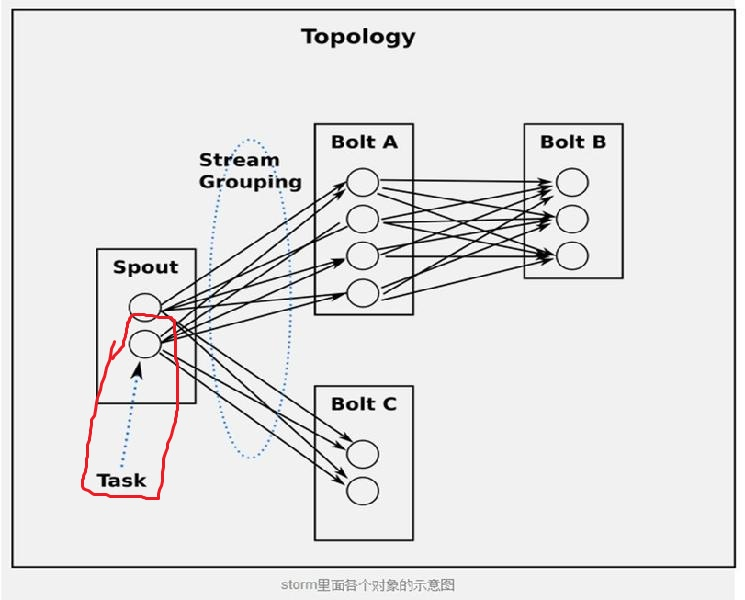

## 数据流组

#### 1. Shuffle Grouping ：随机分组，尽量均匀分布到下游Bolt中

将流分组定义为混排。这种混排分组意味着来自Spout的输入将混排，或随机分发给此Bolt中的任务。shuffle grouping对各个task的tuple分配的比较均匀。

#### 2. Fields Grouping ：按字段分组，按数据中field值进行分组；相同field值的Tuple被发送到相同的Task(一个Bolt内运行多个Task)

这种grouping机制保证相同field值的tuple会去同一个task，这对于WordCount来说非常关键，如果同一个单词不去同一个task，那么统计出来的单词次数就不对了。“if the stream is grouped by the “user-id” field, tuples with the same “user-id” will always go to the same task”. —— 小示例

		1. emit发出的值第一次由哪个task实例处理是随机的，此后再次出现这个值，就固定由最初处理他的那个task实例再次处理，直到topology结束

		2. 一个task实例可以处理多个emit发出的值

		3. 和shuffle Grouping的区别就在于，当emit发出同样的值时，处理他的task是随机的

	
#### 3. All grouping ：广播

广播发送， 对于每一个tuple将会复制到每一个bolt中处理。

#### 4. Global grouping ：全局分组，Tuple被分配到一个Bolt中的一个Task，实现事务性的Topology。

Stream中的所有的tuple都会发送给同一个bolt任务处理，所有的tuple将会发送给拥有最小task_id的bolt任务处理。

##### 5. None grouping ：不分组

不关注并行处理负载均衡策略时使用该方式，目前等同于shuffle grouping,另外storm将会把bolt任务和他的上游提供数据的任务安排在同一个线程下。

##### 6. Direct grouping ：直接分组 指定分组

由tuple的发射单元直接决定tuple将发射给那个bolt，一般情况下是由接收tuple的bolt决定接收哪个bolt发射的Tuple。
这是一种比较特别的分组方法，用这种分组意味着消息的发送者指定由消息接收者的哪个task处理这个消息。 
只有被声明为Direct Stream的消息流可以声明这种分组方法。而且这种消息tuple必须使用emitDirect方法来发射。
消息处理者可以通过TopologyContext来获取处理它的消息的taskid (OutputCollector.emit方法也会返回taskid)。

	