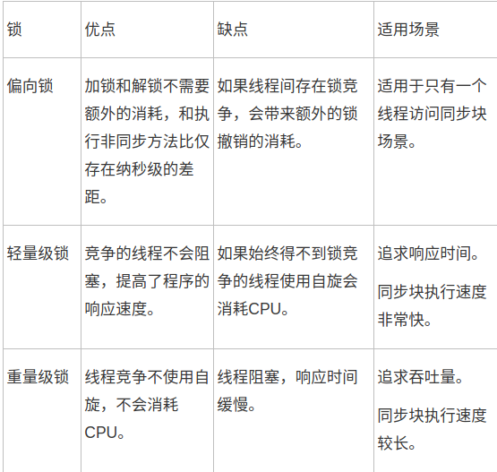

# 锁优化

## 虚拟机锁优化技术

1. 自旋锁
2. 自适应自旋锁
3. 锁消除
4. 锁粗化
5. 轻量级锁
6. 偏向锁

## 自旋锁与自适应自旋锁

在很多应用上，共享数据的锁定状态只会持续很短的一段时间，为了这段时间去挂起和恢复线程并不值得

#### 自旋锁：让线程执行一个忙循环（自旋），如果自选超过了限定次数仍没有成功获得锁，就使用传统方式挂起线程。

#### 自适应自旋锁： 自旋的时间不再固定，由<u>前一次在同个锁上的自旋时间</u>及<u>锁的拥有者</u>的状态来决定。（“自己学习”）

## 锁消除

#### 锁消除： 在虚拟机即时编译器运行时，对一些代码上要求同步，但是是被检测到不可能存在共享数据竞争的锁进行消除。

锁消除的主要判定依据来自于逃逸分析的数据支持，如果判断一段代码中，堆上的所有数据都不会逃逸出去被其他线程访问，那就可以把他们当做栈上数据对待，认为是线程私有的，不进行同步加锁。

## 锁粗化

连续对同一对象反复加锁和解锁，会导致不必要的性能消耗

#### 锁粗化：如果虚拟机探测到有一串零碎的操作都对同一个对象加锁，将会把加锁的同步范围拓展（粗化）到整个操作序列的外部。

## 轻量级锁

“轻量级”是相对于使用操作系统互斥量来实现的传统锁而言，传统的锁叫“重量级锁”

在没有多线程竞争的前提下，能减少传统的重量级锁使用产生的性能消耗。轻量级锁所适应的场景是线程交替执行同步块的情况，如果存在同一时间多个线程访问同一锁的情况，就会导致轻量级锁膨胀为重量级锁。

## 偏向锁

#### 偏向锁： 这个锁会偏向于第一个获得它的线程，在接下来的执行过程中，如果该锁没有被其他线程获取，则持有偏向锁的线程将永远不需要再进行同步

## 几种锁的对比

