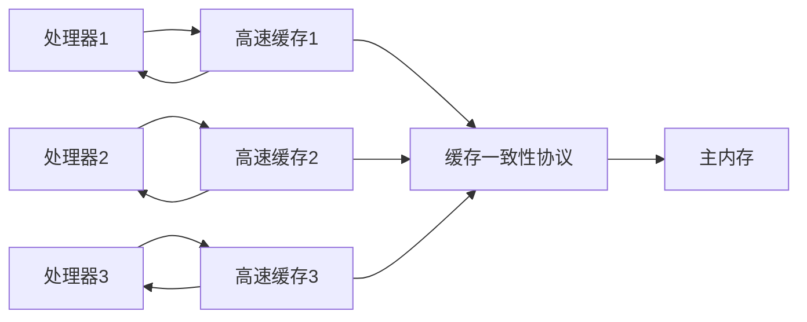

# Java内存模型与线程

基础(硬件效率的一致性):

1. 计算机内存模型:

    为了提高计算能力,减少计算机存储设备与处理器运算速度的差距,现代计算机系统在`内存`与`处理器`之间加入了一层读写速度与处理器运算速度尽可能接近的`高速缓存(Cache)`作为内存与处理器之间的缓冲. 
    将运算需要使用到的数据复制到缓存中,让运算能快速进行,当运算结束后再从缓存同步回内存中,这样处理器就无须等待缓慢的内存读写.
    

+ 这种模型虽然很好的解决了处理器与内存的速度矛盾,但却引入了`缓存一致性(Cahce Coherence)`的问题:

    多处理器系统中,每个处理器都有自己的高速缓存,它们共享同一块`主存(Main Memory)`.当多个处理器的运算都涉及同一块主内存区域时,可能导致各自的缓存数据不一致.
+ 为了解决一致性问题,需要各个处理器访问缓存时都遵循`一致性协议`,读写时根据协议进行操作

2.处理器指令重排序:

Java内存模型:
1.内存模型中的关系:

2.内存间交互操作:

<!-- 3.内存屏蔽指令: -->

