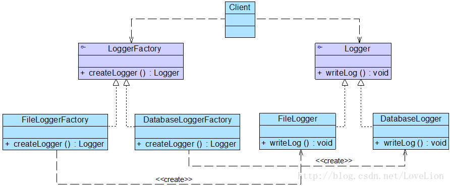

# 工厂方法模式

## 简介

由于简单工厂模式中静态工厂方法通过所传入参数的不同来创建不同的产品，这必定要修改工厂类的源代码，将违背“开闭原则”，所以引入工厂方法模式实现增加新产品而不影响已有代码 

在工厂方法模式中，工厂父类负责定义创建产品对象的公共接口，而工厂子类则负责生成具体的产品对象，这样做的目的是将产品类的实例化操作延迟到工厂子类中完成，即通过工厂子类来确定究竟应该实例化哪一个具体产品类。

## 结构

1. Product(抽象产品):

定义产品的接口,工厂方法模式创建对象的超类型,即具体产品的公共父类

2. ConcreteProduct(具体产品):

实现了抽象产品接口由某种类型的具体工厂创建实例.具体产品和具体工厂之间一一对应

3. Factory(抽象工厂):

声明了工厂方法的方法接口.所有的具体工厂都要实现该接口

4. ConcreteFactory(具体工厂):

实现了抽象工厂中定义的工厂方法,可由客户端调用,新建并放回一个具体产品实例

## Java代码实现

## 优点

1. 在工厂方法模式中，工厂方法用来创建客户所需要的产品，同时还向客户隐藏了哪种具体产品类将被实例化这一细节，用户只需要关心所需产品对应的工厂，无须关心创建细节，甚至无须知道具体产品类的类名。

2. 基于工厂角色和产品角色的多态性设计是工厂方法模式的关键。它能够使工厂可以自主确定创建何种产品对象，而如何创建这个对象的细节则完全封装在具体工厂内部。工厂方法模式之所以又被称为多态工厂模式，是因为所有的具体工厂类都具有同一抽象父类。

3. 使用工厂方法模式的另一个优点是在系统中加入新产品时，无须修改抽象工厂和抽象产品提供的接口，无须修改客户端，也无须修改其他的具体工厂和具体产品，而只要添加一个具体工厂和具体产品就可以了。这样，系统的可扩展性也就变得非常好，完全符合“开闭原则”。

## 缺点

1. 在添加新产品时，需要编写新的具体产品类，而且还要提供与之对应的具体工厂类，系统中类的个数将成对增加，在一定程度上增加了系统的复杂度，有更多的类需要编译和运行，会给系统带来一些额外的开销。

2. 由于考虑到系统的可扩展性，需要引入抽象层，在客户端代码中均使用抽象层进行定义，增加了系统的抽象性和理解难度，且在实现时可能需要用到DOM、反射等技术，增加了系统的实现难度。

## 适用场景

1. 一个类不知道它所需要的对象的类：在工厂方法模式中，客户端不需要知道具体产品类的类名，只需要知道所对应的工厂即可，具体的产品对象由具体工厂类创建；客户端需要知道创建具体产品的工厂类。

2. 一个类通过其子类来指定创建哪个对象：在工厂方法模式中，对于抽象工厂类只需要提供一个创建产品的接口，而由其子类来确定具体要创建的对象，利用面向对象的多态性和里氏代换原则，在程序运行时，子类对象将覆盖父类对象，从而使得系统更容易扩展。

3. 将创建对象的任务委托给多个工厂子类中的某一个，客户端在使用时可以无须关心是哪一个工厂子类创建产品子类，需要时再动态指定，可将具体工厂类的类名存储在配置文件或数据库中。

参阅:
> [工厂三兄弟之工厂方法模式](https://quanke.gitbooks.io/design-pattern-java/%E5%B7%A5%E5%8E%82%E6%96%B9%E6%B3%95%E6%A8%A1%E5%BC%8F-Factory%20Method%20Pattern.html)

> [工厂方法模式(Factory Method Pattern)](http://design-patterns.readthedocs.io/zh_CN/latest/creational_patterns/factory_method.html)