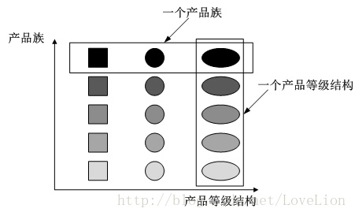

# 抽象工厂模式

## 简介

抽象工厂模式(Abstract Factory Pattern)：提供一个创建一系列相关或相互依赖对象的接口，而无须指定它们具体的类。抽象工厂模式又称为Kit模式，属于对象创建型模式。

抽象工厂模式与工厂方法模式最大的区别在于，工厂方法模式针对的是一个产品等级结构，而抽象工厂模式需要面对多个产品等级结构，一个工厂等级结构可以负责多个不同产品等级结构中的产品对象的创建。 
当一个工厂等级结构可以创建出分属于不同产品等级结构的一个产品族中的所有对象时，抽象工厂模式比工厂方法模式更为简单、更有效率。 
可以说,抽象工厂模式是工厂方法模式复杂情况下的改进方案.

+ 抽象工厂模式的特点:

    增加新的产品族符合"开闭原则",在增加新的产品结构不满足"开闭原则"

## 结构

1. AbstractFactory(抽象工厂):

声明了一组用于创建一族产品的方法,每一个方法对应一种产品.

2. ConcreteFactory(具体工厂):

实现了在抽象工厂中声明的创建具体产品的方法,生成一组具体产品,这些产品构成了一个产品族.

3. AbstractProduct(抽象产品):

为每种产品声明接口,在抽象产品中声明了产品所有的业务方法.

4. ConcreteProduct(具体产品):

定义具体工厂创建的具体产品对象,实现抽象产品接口中声明的业务方法.

## Java代码

## 优点

1. 抽象工厂模式隔离了具体类的生成，使得客户并不需要知道什么被创建。由于这种隔离，更换一个具体工厂就变得相对容易，所有的具体工厂都实现了抽象工厂中定义的那些公共接口，因此只需改变具体工厂的实例，就可以在某种程度上改变整个软件系统的行为。

2. 当一个产品族中的多个对象被设计成一起工作时，它能够保证客户端始终只使用同一个产品族中的对象。

3. 增加新的产品族很方便，无须修改已有系统，符合“开闭原则”。

## 缺点

增加新的产品等级结构麻烦，需要对原有系统进行较大的修改，甚至需要修改抽象层代码，这显然会带来较大的不便，违背了“开闭原则”。

## 适用场景

1. 一个系统不应当依赖于产品类实例如何被创建、组合和表达的细节，这对于所有类型的工厂模式都是很重要的，用户无须关心对象的创建过程，将对象的创建和使用解耦.

2. 系统中有多于一个的产品族，而每次只使用其中某一产品族。可以通过配置文件等方式来使得用户可以动态改变产品族，也可以很方便地增加新的产品族.

3. 属于同一个产品族的产品将在一起使用，这一约束必须在系统的设计中体现出来。同一个产品族中的产品可以是没有任何关系的对象，但是它们都具有一些共同的约束，如同一操作系统下的按钮和文本框，按钮与文本框之间没有直接关系，但它们都是属于某一操作系统的，此时具有一个共同的约束条件：操作系统的类型.

4. 产品等级结构稳定，设计完成之后，不会向系统中增加新的产品等级结构或者删除已有的产品等级结构.
