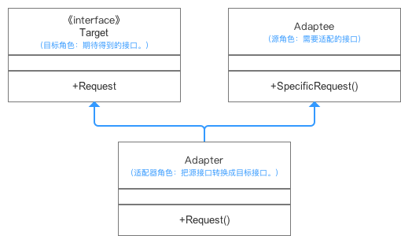
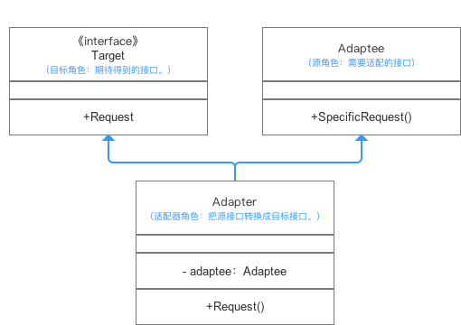

# 适配器模式

## 简介

客户端可以通过目标类的接口访问它所提供的服务。有时，现有的类可以满足客户类的功能需要，但是它所提供的接口不一定是客户类所期望的，这可能是因为现有类中方法名与目标类中定义的方法名不一致等原因所导致的。
在这种情况下，现有的接口需要转化为客户类期望的接口，这样保证了对现有类的重用。

+ 两种适配器模式:

1. 类适配器: 把适配的类的API转换成为目标类的API,使用继承连接到适配类

2. 对象适配器: 也是把适配的类的API转换成为目标类的API,使用委派关系连接到适配类

## 结构

Target：目标抽象类(适配目标)
Adapter：适配器类(适配出来的最终类)
Adaptee：适配者类(被适配的源类)
Client：客户类(调用适配器的类)

## Java代码实现

## 优点

1. 将目标类和适配者类解耦，通过引入一个适配器类来重用现有的适配者类，无须修改原有结构.

2. 增加了类的透明性和复用性，将具体的业务实现过程封装在适配者类中，对于客户端类而言是透明的，而且提高了适配者的复用性，同一个适配者类可以在多个不同的系统中复用.

3. 灵活性和扩展性都非常好，通过使用配置文件，可以很方便地更换适配器，也可以在不修改原有代码的基础上增加新的适配器类，完全符合“开闭原则”.

## 缺点

1. 对于Java、C#等不支持多重类继承的语言，一次最多只能适配一个适配者类，不能同时适配多个适配者.

2. 适配者类不能为最终类，如在Java中不能为final类，C#中不能为sealed类.

3. 在Java、C#等语言中，类适配器模式中的目标抽象类只能为接口，不能为类，其使用有一定的局限性.

## 适用场景

1. 系统需要使用一些现有的类，而这些类的接口（如方法名）不符合系统的需要，甚至没有这些类的源代码。+

2. 想创建一个可以重复使用的类，用于与一些彼此之间没有太大关联的一些类，包括一些可能在将来引进的类一起工作。